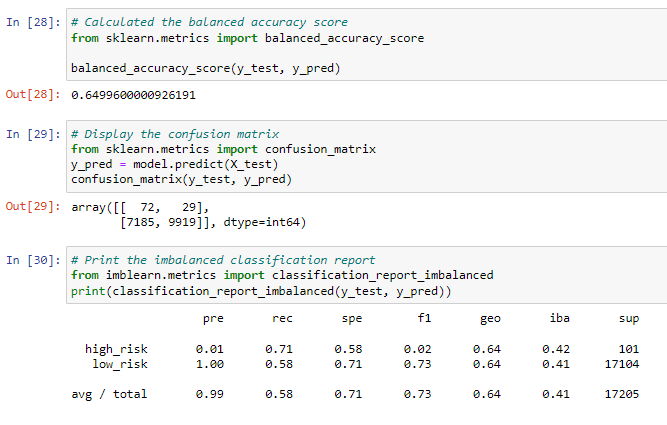
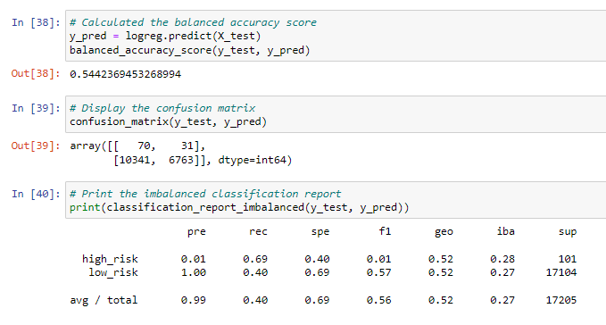
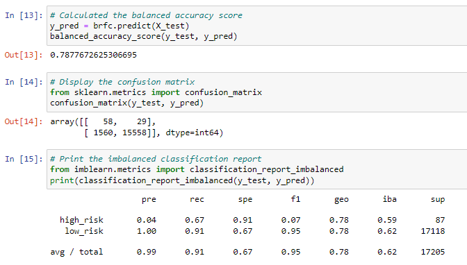
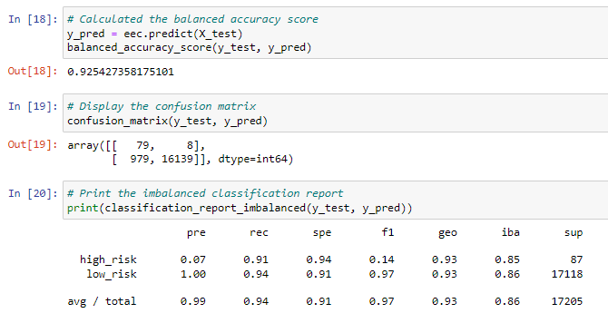

# Credit-Risk-Analysis

## Project Overview
In this assignment, we were asked to use supervised machine learning and apply various models to predict credit risk. Our dataset consists of imbalanced values in favor of low-risk applicants, with a high percentage of low-risk and a small percentage of high-risk loans. Credit risk is an inherently unbalanced classification problem, as good loans easily outnumber risky loans. In this project, we were asked to use imbalanced-learn and scikit-learn libraries to build and evaluate models using resampling.

 

The following objectives were to be completed for our analysis to determine high and low-risk applicants: 
- Using the RandomOverSampler and SMOTE over-sampling algorithms.
- Using the ClusterCentroids under-sampling algorithm.
- Use a combinatorial approach of over- and under-sampling using the SMOTEENN algorithm.
- Compare two ensemble algorithms to determine which algorithm results in the best performance, using BalancedRandomForestClassifier and EasyEnsembleClassifier.
- Evaluate the performance of these models and make a recommendation on whether they should be used to predict credit risk.

 

## Results

### Naive Random Oversampling

 
- Accuracy score: 65%
- .01 of high-risk applicants were predicted and accurate
- .70 of high-risk applicants were identified correctly

### SMOTE Oversampling

 
- Accuracy score: 66%
- .01 of high-risk applicants were predicted and accurate
- .63 of high-risk applicants were identified correctly

### ClusterCentroids Undersampling

 
- Accuracy score: 54%
- .01 of high-risk applicants were predicted and accurate
- .69 of high-risk applicants were identified correctly

### Combination Over and Under Sampling

 
- Accuracy score: 64%
- .01 of high-risk applicants were predicted and accurate
- .68 of high-risk applicants were identified correctly

### Balanced Random Forest

 
- Accuracy score: 79%
- .04 of high-risk applicants were predicted and accurate
- .67 of high-risk applicants were identified correctly

### Easy Ensemble AdaBoost Classifier

 
- Accuracy score: 93%
- .07 of high-risk applicants were predicted and accurate
- .91 of high-risk applicants were identified correctly

## Summary

In summary, all machine learning models consist of weak/poor precision when predicting if an applicant is a high-credit risk.

Utilizing the Easy Ensemble AdaBoost Classifier, the precision significantly increased for high-risk, jumping from .01 to .04 and finally .07 with this model. The recall significantly increased as well, with the lowest being 63% with the SMOTE model and highest being 91% with the AdaBoost Classifier.

Considering all models, the accuracy score landed between 54-93%.

The recommended best model to use to successfully classify risk analysis is the Easy Ensemble AdaBoost classifier, as it has the highest accuracy score, precision, and recall compared to all other models.
